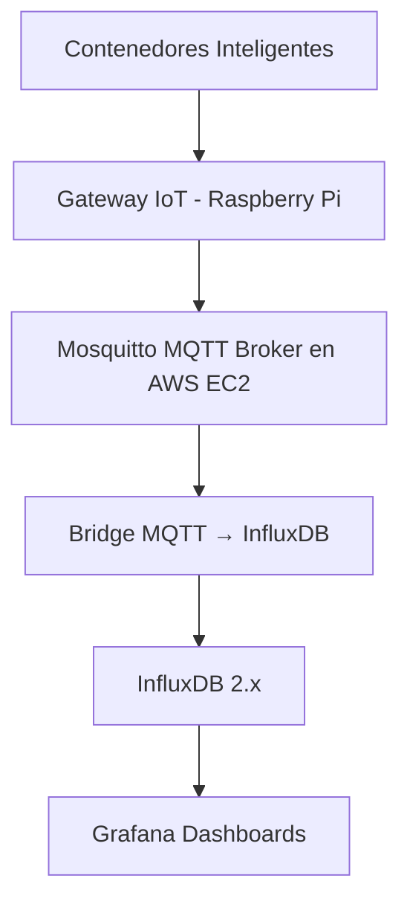

# *Práctica IoT: Sistema de Monitoreo de Contenedores de Basura Inteligentes*

## Información del Proyecto
- **Estudiante:** Hernández Limón Edwin Yair  
- **Número de Control:** 22211580  
- **Materia:** Sistemas Programables  
- **Carrera:** Ingeniería en Sistemas Computacionales  
- **Institución:** Instituto Tecnológico de Tijuana  
- **Fecha:** 19 Octubre 2025  
- **Profesor:** René Solís Reyes  

---

## Objetivo
Implementar un sistema **IoT** capaz de monitorear en tiempo real el **nivel de llenado de contenedores de basura urbanos**, enviando los datos mediante **MQTT** hacia un servidor **AWS EC2**, donde se almacenan en **InfluxDB** y se visualizan en **Grafana**.  
El propósito es optimizar las rutas de recolección y mejorar la gestión de residuos municipales.

---

## Arquitectura del Sistema

---
## Componentes del Stack

- Raspberry Pi: Simulador micro:bit V2 y gateway MQTT
- Mosquitto MQTT Broker: Servidor MQTT en AWS EC2
- InfluxDB 2.x: Base de datos de series de tiempo
- Grafana: Plataforma de visualización y dashboards
- Python Scripts: Simulador micro:bit y bridge MQTT-InfluxDB

---
## Video Demostración

🎥 https://www.loom.com/share/cd556f8b4e4048f9885f0a24a805c367

---
## Implementación Técnica

### 1. Configuración del Broker MQTT en AWS EC2

```
# Instalación de Mosquitto
sudo apt update
sudo apt install mosquitto mosquitto-clients -y

# Configuración del broker
sudo nano /etc/mosquitto/conf.d/default.conf
```

### 2. Simulador micro:bit en Raspberry Pi

Archivo: microbit_simulator.py

```
#!/usr/bin/env python3
import json
import time
import random
from datetime import datetime

def microbit_simulator():
    device_id = "microbit-01"
    seq = 0
    
    while True:
        data = {
            "deviceId": device_id,
            "timestamp": datetime.utcnow().isoformat() + "Z",
            "temperature": round(random.uniform(18.0, 35.0), 2),
            "light_level": random.randint(0, 255),
            "sequence": seq,
            "status": "active"
        }
        
        print(json.dumps(data))
        seq += 1
        time.sleep(5)

if __name__ == "__main__":
    microbit_simulator()
```

### 3. Gateway MQTT en Raspberry Pi

Archivo: raspberry_gateway.py

```
#!/usr/bin/env python3
import json
import time
import random
import paho.mqtt.client as mqtt
from datetime import datetime

# CONFIGURACIÓN - IP de tu EC2
MQTT_BROKER = "3.85.201.184"
MQTT_PORT = 1883
MQTT_TOPIC = "lab/microbit/telemetry"

client = mqtt.Client()
client.connect(MQTT_BROKER, MQTT_PORT, 60)
client.loop_start()

print("🚀 Gateway iniciado - Generando y enviando datos micro:bit...")

device_id = "microbit-01"
seq = 0

while True:
    try:
        # Generar datos directamente
        data = {
            "deviceId": device_id,
            "timestamp": datetime.utcnow().isoformat() + "Z",
            "temperature": round(random.uniform(18.0, 35.0), 2),
            "light_level": random.randint(0, 255),
            "sequence": seq,
            "status": "active"
        }
        
        # Enviar via MQTT
        client.publish(MQTT_TOPIC, json.dumps(data))
        print(f"📤 [{seq}] Enviado: {data['temperature']}°C, Luz: {data['light_level']}")
        
        seq += 1
        time.sleep(5)
            
    except Exception as e:
        print(f"❌ Error: {e}")
        time.sleep(5)
```

### 4. Bridge MQTT-InfluxDB en AWS EC2

Archivo: mqtt_to_influxdb.py

```
#!/usr/bin/env python3
import paho.mqtt.client as mqtt
import json
from datetime import datetime
from influxdb_client import InfluxDBClient, Point, WritePrecision

# Configuración
MQTT_BROKER = "localhost"
MQTT_TOPIC = "lab/microbit/telemetry"

INFLUXDB_URL = "http://localhost:8086"
INFLUXDB_TOKEN = "microbit-token-final"
INFLUXDB_ORG = "IoTOrg"
INFLUXDB_BUCKET = "microbit-data"

# Clientes
influx_client = InfluxDBClient(url=INFLUXDB_URL, token=INFLUXDB_TOKEN, org=INFLUXDB_ORG)
write_api = influx_client.write_api()

mqtt_client = mqtt.Client()

def on_connect(client, userdata, flags, rc):
    if rc == 0:
        print("✅ Conectado a MQTT Broker")
        client.subscribe(MQTT_TOPIC)
        print(f"✅ Suscrito al topic: {MQTT_TOPIC}")
    else:
        print(f"❌ Error conexión MQTT: {rc}")

def on_message(client, userdata, msg):
    try:
        data = json.loads(msg.payload.decode())
        print(f"📨 Recibido: {data['deviceId']} - Temp: {data['temperature']}°C")
        
        point = (
            Point("microbit_sensors")
            .tag("device_id", data["deviceId"])
            .tag("status", data["status"])
            .field("temperature", float(data["temperature"]))
            .field("light_level", int(data["light_level"]))
            .field("sequence", int(data["sequence"]))
            .time(datetime.utcnow(), WritePrecision.NS)
        )
        
        write_api.write(bucket=INFLUXDB_BUCKET, record=point)
        print("✅ Datos guardados en InfluxDB")
        
    except Exception as e:
        print(f"❌ Error procesando mensaje: {e}")

mqtt_client.on_connect = on_connect
mqtt_client.on_message = on_message

print("🚀 Iniciando bridge MQTT → InfluxDB...")
try:
    mqtt_client.connect(MQTT_BROKER, 1883, 60)
    mqtt_client.loop_forever()
except KeyboardInterrupt:
    print("🛑 Deteniendo bridge...")
    mqtt_client.disconnect()
    influx_client.close()
except Exception as e:
    print(f"❌ Error: {e}")
```

### 5. Configuración del Servicio Systemd en EC2

Archivo: /etc/systemd/system/microbit_bridge.service

```
Description=Microbit MQTT to InfluxDB Bridge
After=network.target mosquitto.service

[Service]
Type=simple
User=ubuntu
WorkingDirectory=/home/ubuntu
Environment=PATH=/home/ubuntu/venv/bin:/usr/local/sbin:/usr/local/bin:/usr/sbin:/usr/bin:/sbin:/bin
ExecStart=/home/ubuntu/venv/bin/python /home/ubuntu/mqtt_to_influxdb.py
Restart=always
RestartSec=10

[Install]
WantedBy=multi-user.target
```

Comandos de gestión:
```
sudo systemctl daemon-reload
sudo systemctl enable microbit_bridge.service
sudo systemctl start microbit_bridge.service
sudo systemctl status microbit_bridge.service
```

---
## Conclusión

Se implementó exitosamente un sistema IoT completo utilizando un micro:bit V2 simulado en Raspberry Pi, que demuestra la integración de dispositivos IoT con servicios en la nube de AWS.
El sistema transmite telemetría de temperatura y luz ambiental mediante MQTT, almacena los datos en InfluxDB como series de tiempo y los visualiza en dashboards interactivos de Grafana.
La arquitectura es escalable y puede adaptarse para múltiples dispositivos micro:bit reales, proporcionando una base sólida para aplicaciones de monitoreo ambiental en tiempo real.
