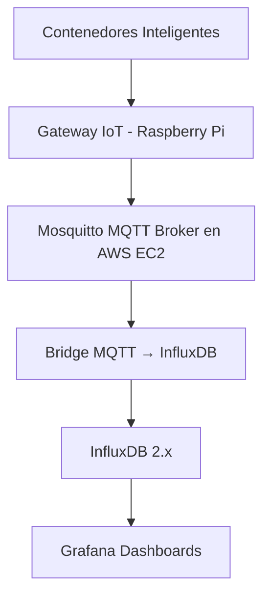

# *Práctica IoT: Sistema de Monitoreo de Contenedores de Basura Inteligentes*

## Información del Proyecto
- **Estudiante:** Hernández Limón Edwin Yair  
- **Número de Control:** 22211580  
- **Materia:** Sistemas Programables  
- **Carrera:** Ingeniería en Sistemas Computacionales  
- **Institución:** Instituto Tecnológico de Tijuana  
- **Fecha:** 19 Octubre 2025  
- **Profesor:** René Solís Reyes  

---

## Objetivo
Implementar un sistema **IoT** capaz de monitorear en tiempo real el **nivel de llenado de contenedores de basura urbanos**, enviando los datos mediante **MQTT** hacia un servidor **AWS EC2**, donde se almacenan en **InfluxDB** y se visualizan en **Grafana**.  
El propósito es optimizar las rutas de recolección y mejorar la gestión de residuos municipales.

---

## Arquitectura del Sistema

---
## Componentes del Stack

- Raspberry Pi: Gateway IoT y simulador de sensores ultrasónicos
- Mosquitto MQTT Broker: Servidor de mensajería en AWS EC2
- InfluxDB 2.x: Base de datos de series de tiempo
- Grafana: Visualización de métricas en tiempo real
- Python Scripts: Simulador de sensores, publicador MQTT y bridge InfluxDB

---
## Video Demostración

🎥 https://www.loom.com/share/cd556f8b4e4048f9885f0a24a805c367

---
## Presentación
https://www.canva.com/design/DAG2Sa8wvhE/_niuPRQVdkKLb6OKQsDf5A/view
---
## Implementación Técnica

### 1. Configuración del Broker MQTT en AWS EC2

```
# Instalación de Mosquitto
sudo apt update
sudo apt install mosquitto mosquitto-clients -y

# Activar servicios
sudo systemctl enable mosquitto
sudo systemctl start mosquitto
```

### 2. Simulador micro:bit en Raspberry Pi

Archivo: sensor_basura_simulator.py

```
#!/usr/bin/env python3
import json
import time
import random
from datetime import datetime

def simulador_contenedores():
    contenedores = ["cont-001", "cont-002", "cont-003"]
    ubicaciones = ["Centro", "Zona Norte", "Parque Industrial"]

    while True:
        for i, contenedor in enumerate(contenedores):
            data = {
                "contenedor_id": contenedor,
                "ubicacion": ubicaciones[i],
                "porcentaje_lleno": round(random.uniform(0, 100), 2),
                "temperatura": round(random.uniform(20, 45), 2),
                "timestamp": datetime.utcnow().isoformat() + "Z"
            }

            print(json.dumps(data))
            time.sleep(3)

if __name__ == "__main__":
    simulador_contenedores()
```

### 3. Gateway MQTT en Raspberry Pi

Archivo: gateway_basura.py

```
#!/usr/bin/env python3
import json
import time
import random
import paho.mqtt.client as mqtt
from datetime import datetime

MQTT_BROKER = "3.85.201.184"  # IP pública de tu EC2
MQTT_PORT = 1883
MQTT_TOPIC = "ciudad/basura/contenedores"

client = mqtt.Client()
client.connect(MQTT_BROKER, MQTT_PORT, 60)
client.loop_start()

print("🚀 Gateway iniciado - Enviando datos de contenedores...")

contenedores = ["cont-001", "cont-002", "cont-003"]
ubicaciones = ["Centro", "Zona Norte", "Parque Industrial"]

while True:
    try:
        for i, contenedor in enumerate(contenedores):
            data = {
                "contenedor_id": contenedor,
                "ubicacion": ubicaciones[i],
                "porcentaje_lleno": round(random.uniform(0, 100), 2),
                "temperatura": round(random.uniform(20, 45), 2),
                "timestamp": datetime.utcnow().isoformat() + "Z"
            }

            client.publish(MQTT_TOPIC, json.dumps(data))
            print(f"📤 {contenedor} → {data['porcentaje_lleno']}% lleno, Temp: {data['temperatura']}°C")

        time.sleep(5)
    except Exception as e:
        print(f"❌ Error: {e}")
        time.sleep(5)
```

### 4. Bridge MQTT-InfluxDB en AWS EC2

Archivo: basura_to_influxdb.py

```
#!/usr/bin/env python3
import paho.mqtt.client as mqtt
import json
from datetime import datetime
from influxdb_client import InfluxDBClient, Point, WritePrecision

# Configuración
MQTT_BROKER = "localhost"
MQTT_TOPIC = "ciudad/basura/contenedores"

INFLUXDB_URL = "http://localhost:8086"
INFLUXDB_TOKEN = "token-basura-monitoring"
INFLUXDB_ORG = "IoTOrg"
INFLUXDB_BUCKET = "basura-data"

# Clientes
influx_client = InfluxDBClient(url=INFLUXDB_URL, token=INFLUXDB_TOKEN, org=INFLUXDB_ORG)
write_api = influx_client.write_api()
mqtt_client = mqtt.Client()

def on_connect(client, userdata, flags, rc):
    if rc == 0:
        print("✅ Conectado a MQTT Broker")
        client.subscribe(MQTT_TOPIC)
    else:
        print(f"❌ Error conexión MQTT: {rc}")

def on_message(client, userdata, msg):
    try:
        data = json.loads(msg.payload.decode())
        print(f"📨 Recibido: {data['contenedor_id']} - {data['porcentaje_lleno']}%")

        point = (
            Point("contenedores_basura")
            .tag("contenedor_id", data["contenedor_id"])
            .tag("ubicacion", data["ubicacion"])
            .field("porcentaje_lleno", float(data["porcentaje_lleno"]))
            .field("temperatura", float(data["temperatura"]))
            .time(datetime.utcnow(), WritePrecision.NS)
        )

        write_api.write(bucket=INFLUXDB_BUCKET, record=point)
        print("✅ Datos guardados en InfluxDB")
    except Exception as e:
        print(f"❌ Error procesando mensaje: {e}")

mqtt_client.on_connect = on_connect
mqtt_client.on_message = on_message

print("🚀 Iniciando bridge MQTT → InfluxDB...")
try:
    mqtt_client.connect(MQTT_BROKER, 1883, 60)
    mqtt_client.loop_forever()
except KeyboardInterrupt:
    print("🛑 Deteniendo bridge...")
    mqtt_client.disconnect()
    influx_client.close()
```


### 5. Configuración del Servicio Systemd en EC2

Archivo: /etc/systemd/system/basura_bridge.service

```
Description=Bridge MQTT a InfluxDB - Sistema Basura IoT
After=network.target mosquitto.service

[Service]
Type=simple
User=ubuntu
WorkingDirectory=/home/ubuntu
ExecStart=/usr/bin/python3 /home/ubuntu/sistema-basura-iot/src/basura_to_influxdb.py
Restart=always
RestartSec=10

[Install]
WantedBy=multi-user.target
```


Comandos de gestión:
```
sudo systemctl daemon-reload
sudo systemctl enable basura_bridge.service
sudo systemctl start basura_bridge.service
sudo systemctl status basura_bridge.service
```

---
## Conclusión

Se desarrolló e implementó un sistema IoT funcional para el monitoreo inteligente de contenedores de basura, demostrando la integración de MQTT, InfluxDB y Grafana sobre una arquitectura en AWS EC2.
El sistema permite registrar telemetría simulada de sensores, almacenar datos como series de tiempo y visualizar las métricas en tiempo real.
La infraestructura resultante es escalable, modular y fácilmente adaptable para sensores reales en escenarios urbanos, contribuyendo al desarrollo de ciudades inteligentes y sostenibles.
